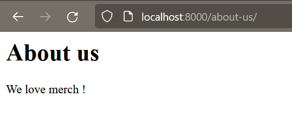

# Serve content using a view

# Display a new page in 5 lines of code !

Open the file `listings/views.py`. For now it looks like this:
```python
from django.shortcuts import render

# Create your views here.
```

Let's delete the comment and add a simple function. We have also to add an import declaration on the top of the file:
```python
from django.http import HttpResponse
from django.shortcuts import render

def hello(request):
  return HttpResponse('<h1>Hello Django!</h1>')
```

Let's now open `merchex/urls.py`. For now it looks like this (without comments):
```python
from django.contrib import admin
from django.urls import path

urlpatterns = [
    path('admin/', admin.site.urls),
]
```

Let's import the module `views` we edited at the previous step by adding a new import declaration. Then we will add a new element to the liste `urlpatterns`, where we reference the view function that we just created:
```python
from django.contrib import admin
from django.urls import path
from listings import views
urlpatterns = [
    path('admin/', admin.site.urls),
    path('hello/', views.hello),
]
```

Let's try our new view (don't forget to run the server by using `python manage.py runserver`): [http://localhost:8000/hello/](http://localhost:8000/hello/)


Let's create path for a `about-us` view:
- In merchex/urls.py:
  ```python
  urlpatterns = [
      path('admin/', admin.site.urls),
      path('hello/', views.hello),
      path('about-us/', views.about), # add this line
  ]
  ```
- In `listings/views.py`:
  ```python
  from django.http import HttpResponse
  from django.shortcuts import render

  def hello(request):
      return HttpResponse('<h1>Hello Django !</h1>')

  # add this function
  def about(request):
      return HttpResponse('<h1>About us</h1> <p>We love merch !</p>')
  ```

Try the new views : [http://localhost:8000/about-us/](http://localhost:8000/about-us/)



# Time to Practice : Create new views!

With what you've just learned, add two new pages to your application. These are pages that we will build on in the following chapters.

The two pages will be a "listings" page (where we will eventually display a list of ads for items) and a "contact us" page (where we will create a contact form). For now, these pages can be very simple: just an `<h1>` tag and a `<p>` tag. We will build the full content later in the course.

You should visit these pages in the browser to make sure they display correctly.

---

## Next Step : [Save data to a database with a model and a migration](./model_migration.md#save-data-to-a-database-with-a-model-and-a-migration)
### Previous step : [Getting Started](./getting_started.md#getting-started)
### [Back to menu](../README.md#django-tutorial)