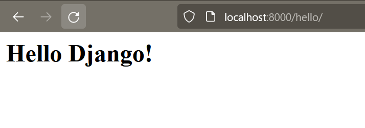

# Serve content using a view

# Display a new page in 5 lines of code !

Open the file *listings/views.py*. For now it looks like this:
```python
from django.shortcuts import render

# Create your views here.
```

Let's delete the comment and add a simple function. We have also to add an import declaration on the top of the file:
```python
from django.http import HttpResponse
from django.shortcuts import render

def hello(request):
  return HttpResponse('<h1>Hello Django!</h1>')
```

Let's now open *merchex/urls.py*. For now it looks like this (without comments):
```python
from django.contrib import admin
from django.urls import path

urlpatterns = [
    path('admin/', admin.site.urls),
]
```

Let's import the module *views* we edited at the previous step by adding a new import declaration. Then we will add a new element to the liste *urlpatterns*, where we reference the view function that we just created:
```python
from django.contrib import admin
from django.urls import path
from listings import views
urlpatterns = [
    path('admin/', admin.site.urls),
    path('hello/', views.hello),
]
```

Let's try our new view (don't forget to run the server by using **python manage.py runserver**): [http://localhost:8000/hello/](http://localhost:8000/hello/)



---

## Next Step : [Serve content using a view](./create_view.md#serve-content-using-a-view)
### Previous step : [Getting Started](./getting_started.md#getting-started)
### [Back to menu](../README.md#django-tutorial)