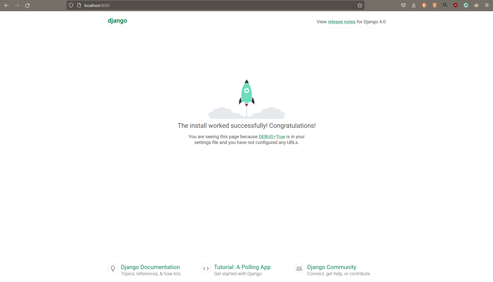
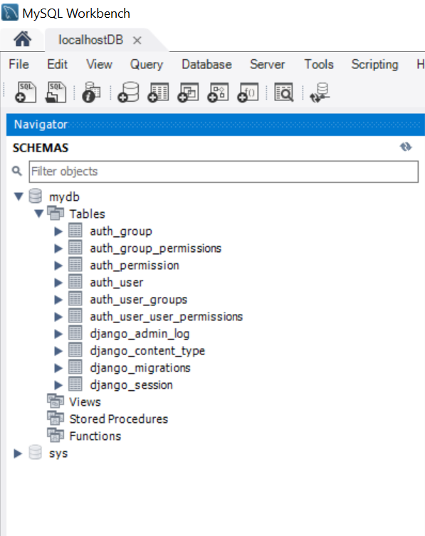

# Getting started

# Install Django

Create a virtual environment
```sh
python -m venv env
```

Activate the virtual environment:
- On Windows:
    - cmd:
      ```sh
      env\Scripts\activate.bat
      ```
    - PowerShell:
      ```sh
      env/Scripts/activate.ps1
      ```
    For PowerShell you may have to allow scripts to run using this commande on PowerShell(Admin): 
    ```sh 
    set-executionpolicy RemoteSigned
    ``` 

- On Mac or Linux:
  ```sh
  source env/bin/activate
    ```

To deactivate the virtual environment (don't do it now!):
```sh
deactivate
```

Install Django
```sh
pip install django
```
By installing Django, other packages needed by Django are also installed.
Keep a trace of all the packages needed in a file :
```sh
pip freeze > requirements.txt
```


# Configure a new project with Django 
Create a project
```sh
django-admin startproject merchex # django-admin startproject [project name]
```
Go to the project directory
```sh
cd ./merchex
```

Run the development server
```sh
python manage.py runserver
```

Try the server by going to [http://127.0.0.1:8000](http://127.0.0.1:8000)



Stop the server by using Ctrl+C

# Create the database for the project

Install mysql client for Django
By default Django use SqlLite. To use instead MySQL do this:
  - Install another library to use mysql database:
  ```sh
  pip install mysqlclient
  ```
- Open the setting.py file and inside DATABASES variable configure mysql database values:
  ```python
  DATABASES = {
      'default': {
        'ENGINE': 'django.db.backends.mysql',
        'NAME': 'mydb',
        'USER': 'root',
        'PASSWORD': 'root',
        'HOST': 'localhost',
        'PORT': '3306',
    }
  }
  ```
---
Execute the commande **migrate**:
```sh
python manage.py migrate
```

You can see that Django already created tables in the database:




# Create a Django application to the project

Create an application
```sh
python manage.py startapp listings #python manage.py startapp [application name]
```

Add the created application to the project in settings.py:
```python
INSTALLED_APPS = [
    'django.contrib.admin',
    'django.contrib.auth',
    'django.contrib.contenttypes',
    'django.contrib.sessions',
    'django.contrib.messages',
    'django.contrib.staticfiles',
    'listings', # application name
]
```

---
## Next Step : [Serve content using a view](./create_view.md#serve-content-using-a-view)

[back to menu](../README.md#django-tutorial)