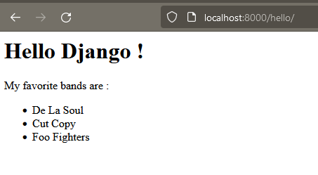

# Save data to a database with a model and a migration

1. [Add a model at models.py](#add-a-model-at-modelspy)
2. [Understand how to manage database status with a migration](#understand-how-to-manage-database-status-with-a-migration)
3. [Call *migrate* with the CLI](#call-migrate-with-the-cli)
4. [Register objects in the database in the Django shell](#register-objects-in-the-database-in-the-django-shell)
5. [Update the view to show *Band* objects](#update-the-view-to-show-band-objects)
6. [Time to Practice : Create new model!](#time-to-practice--create-new-model)

# Add a model at models.py

Open `models.py` that looks like this :
```python
from django.db import models

# Create your models here.

```

Create a class called `Band` like this :
```python
class Band(models.Model):
    name = models.fields.CharField(max_length=100)
```

# Understand how to manage database status with a migration

If we want to store groups in our database, we will need a new table, containing a column for each field we added to our group model, and an id column to serve as the primary key: a unique identifier for each row in the table.

The structure of a database, in terms of tables and columns, is called a schema.

If we were building our database schema manually, we could write a SQL query or use a database management GUI, to create our first table.

But in Django, we do things differently. We use a subcommand of the command line utility that will generate instructions to build the table. And then we use another subcommand to execute those instructions. These instructions are called a migration.

A migration is a set of instructions to move your database schema from one state to another. It is important to note that these instructions can be executed automatically, like a code.

In programming, we often talk about "configuration by code". This is a philosophy that states that all the steps required to build your application should not be done by hand, but rather written into the code. Why is this? For several reasons:

- Manual steps can easily be forgotten, but steps written in code can be stored in a repository so that they are as secure as all your other source code.

- When steps are kept in your repository, they can be easily shared with other team members.

- Steps written as code can be executed automatically by your computer. This method is fast and reliable, especially if there are several steps.

Now that we know why migrations are important, let's create one for our group model.

```sh
python manage.py makemigrations
```
The CLI output tells us that a new migration has been registered in `listings/migrations/0001_initial.py`, and that its purpose is to "Create the Band model", which actually means that this migration will create a table in the database for our Band model.

The advantage of this command is that it scans our `models.py` file for any changes and determines the type of migration to generate.

Now that we have our migration (our instructions), we need to execute these instructions on the database.

# Call `migrate` with the CLI

```sh
python manage.py migrate
```

Remember in the installation chapter when we added `listings` to the `INSTALLED_APPS` of our project? Django searched each of those installed applications for new migrations to run, found our new migration, and "applied" it: it executed those instructions on the database.

We are finally ready to use our model to create group objects!

# Register objects in the database in the Django shell

In this section, we will write code in the Django shell.

The Django shell is simply an ordinary Python shell that runs your Django application. You can think of it as a place where you can try out code in real time: every time you press Enter, the line of code you just typed is executed. So while code you type in a Python `module/file` may be executed many times, code you type in the Django shell is executed only once and then forgotten.

Let's use the shell to create some group objects, then save those objects to the database.

You can use these examples, or feel free to add your own favorite bands, musicians or composers!

Open the shell using the command line utility :
```sh
python manage.py shell
```

At the shell prompt (>>>), type the following code to import our band model:
```sh
>>> from listings.models import Band
```

Press **Enter** to execute this line.

Next, we will create a new instance of the Band model:
```sh
>>> band = Band()
>>> band.name = 'De La Soul'
```
Take a look at the current status of the object by simply typing `band`:
```sh
>>> band
<Band: Band object (None)>
```
The shell tells us that we have a band object, but the id isNone, it doesn't have an id yet.

Now let's save this object in the database:
```sh
>>> band.save()
```
... and then look at the state of the object again:
```sh
>>> band
<Band: Band object (1)>
```
... now the id is `1`.

Let's start again, this time giving a different name to the *Band* object. You can reuse the band variable and give it a new `Band` :
```sh
>>> band = Band()
>>> band.name = 'Cut Copy'
>>> band.save()
>>> band
<Band: Band object (2)>
```
Now let's try another method. Here is a one-line alternative that does the same thing:
```sh
>>> band = Band.objects.create(name='Foo Fighters')
```

We can look at the object and the value of its `name` field:
```sh
>>> band
<Band: Band object (3)>
>>> band.name
'Foo Fighters'
```

Our database now contains 3 group objects. We can check this like this:
```sh
>>> Band.objects.count()
3
>>> Band.objects.all()
<QuerySet [<Band: Band object (1)>, <Band: Band object (2)>, <Band: Band object (3)>]>
```

Press Ctrl + D or write `exit()` to exit the shell.

# Update the view to show `Band` objects

Open `listings/views.py` and find our `hello` view function, as we left it in the last chapter:
```python
def hello(request):
  return HttpResponse('<h1>Hello Django!</h1>')
```

In the previous section, we saw how to get all group objects from the database in the shell :`Band.objects.all()`. Let's do the same thing in our view and store the objects in a variable :
```python
...
from listings.models import Band
...
def hello(request):
  bands = Band.objects.all()
  return HttpResponse('<h1>Hello Django!</h1>')
```
Don't forget to import your `Band` model at the top!

The `bands` variable now contains a list of all the bands that can be found in the database. This means that it is now possible to access each of the individual band objects using Python's index notation, like this:
```python
# example

bands[0] # for the first objet `Band`...
bands[1] # for the second one..
bands[2] # et the third one...
```

Then, to access the `name` field of one of theseBand objects, we will call the name attribute of the object using Python's dot notation, as we would with any other object:
```python
# example

bands[0].name # return « De La Soul »
```
Let's use these techniques to display the names of our bands in our page:

```python
...
from listings.models import Band
...

def hello(request):
  bands = Band.objects.all()
  return HttpResponse(f"""
    <h1>Hello Django !</h1>
    <p>My favorite bands are :<p>
    <ul>
      <li>{bands[0].name}</li>
      <li>{bands[1].name}</li>
      <li>{bands[2].name}</li>
    </ul>
  """)
```
To help with readability, we have:

- used triple quotes (""") to spread our HTML string over several lines;

- made this string an `f-string` (f""") so that we can inject our group names into the string using{ ... }as placeholders.

Let's look at this page again in the browser:[ http://127.0.0.1:8000/hello/]( http://127.0.0.1:8000/hello/)



# Time to Practice : Create new model!

With what you've just learned, add a new model to your application. This model will follow the *Listing* objects. There should be only one field called *title*: the title of the listing. The *title* should have a maximum length of 100 characters.

Your model will have to be accompanied by a migration, which will have to be executed on the database. You can then use the Django shell to insert at least 3 objects in the database.

Some sample titles for these ads:

    "ORIGINAL De La Soul Tour Poster - Fillmore Auditorium San Francisco November 2001"

    "Cut Copy concert T-shirt, Free Your Mind tour, 2013"

    "Foo Fighters - Big Me single promo poster, late 90s"

    "Beethoven - Moonlight Sonata - original manuscript EXTREMELY RARE"

---
## Next Step : [Separate the application logic from the presentation with a Django template](./template.md#separate-the-application-logic-from-the-presentation-with-a-django-template)
### Previous step : [Serve content using a view](./create_view.md#serve-content-using-a-view)
### [Back to menu](../README.md#django-tutorial)