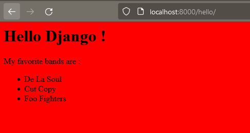

# Add structure and style to your site with a basic template, CSS and static files

1. [Separate site-wide HTML from page-specific HTML](#separate-site-wide-html-from-page-specific-html)
2. [Enrich a basic template with a page model](#enrich-a-basic-template-with-a-page-model)
3. [Give style to your site with CSS](#give-style-to-your-site-with-css)
4. [Time to Practice : Make all your page templates enhance your base template!](#time-to-practice--make-all-your-page-templates-enhance-your-base-template)

# Separate site-wide HTML from page-specific HTML

Did you notice at the end of the last chapter that we now have repeated code in our template files? This will become unmanageable as we add more templates to our site: if we want to change the head tag, we'll have to change it in every template.

Let's see how we can apply the [DRY](https://en.wikipedia.org/wiki/Don%27t_repeat_yourself) principle: Don't Repeat Yourself, and avoid repeating code in our templates by using a basic template.

To begin, we need to look at our existing templates and ask ourselves two questions:
- What are the differences between these templates?
- What doesn't change?

If we look at all the templates side by side, we can see that the common elements among the three are:
- the `<html>` tags
- the `<head>` tags
- the `<title>` tags
- the `<body>` tags

Since these tags are common to all pages, we will define them in one place: our base template.

Let's place this HTML code for the entire site in a new template file at `listings/templates/listings/base.html`. Note the code we add inside `<body>` tags:
```html
<html>
    <head><title>Merchex</title></head>
    <body>

        

    </body>
</html>
```
In our HTML, we added a Django template tag: the block tag. And we closed it with an `endblock` tag.

We also gave a name to this block: we called it `content`.

We can think of the `block` tag as a placeholder, into which we can inject content; in this sense, it is similar to template variables.

What we want to do next is inject our page-specific HTML into this block. Let's go back to our page templates to see how we do it.

# Enrich a basic template with a page model

Let's open our `hello.html` template. To start, let's delete all the HTML that we now define in our base template. (I'm also deleting some of the example code I added in the last chapter.) We should end up with something like this:
```html
<h1>Hello Django !</h1>
<p>My favorite bands are :</p>
<ul>
  
  <li>{{ band.name }}</li>
  
</ul>
```
Next, let's add these additional template tags at the top and bottom of the template:
```html




<h1>Hello Django !</h1>
...
</ul>


```
The `extends` tag at the top tells Django that we want this template to **inherit** our base template.

Around our content, we have an opening and closing `block` tag and we've given the opening tag the same name as in our base template: `content`.

As you may have guessed, Django will take everything in the block named `content` in our page template and inject it into the block with the same name in our base template. Now let's see how this works in our browser:
[http://localhost:8000/hello/](http://localhost:8000/hello/)


# Give style to your site with CSS

With our site's `<head>` tag defined in our base template, this is a good time to add a stylesheet.

Files such as CSS are called **static** files in Django, because once the application is running, they don't change.

We place static files in a specific location in our application. Create a folder in `listings/static/listings/` and inside, create a new file called `styles.css` .
```css
* { background: red }
```
This is not the final stylesheet that we will actually use in our application, it is more like the "Hello World!" of stylesheets. This will give all the elements on our page a red background. This is just to test that our stylesheet loads correctly!

Let's open `listings/templates/listings/base.html` and add a `<link>` tag, under the title, to load our stylesheet :
```html
<html>
    <head>
        <title>Merchex</title>
        <link rel="stylesheet" href="" />
```
What do you notice about the `href` attribute in our `<link>` tag?

This is actually another template tag! This `static` tag tells Django that it needs to look in the special `static` directory we created earlier and try to find the file we created: `listings/styles.css`.

Now, in order for the `static` tag to work, we must first "load" it into this template. We do this by adding a `load` tag at the very beginning of the file, like this:
```html


<html>

...
```

Let's take a look at the result in the browser: [http://localhost:8000/hello/](http://localhost:8000/hello/)



If you don't see a red background, try stopping and restarting the development server. This will give Django a chance to find your new static directory. You can also try doing a forced refresh in your browser.

# Time to Practice : Make all your page templates enhance your base template!

With what you've learned, update each of your page templates, so that they all inherit your base template.

If you get stuck, remember that all your page templates must have :
- an `extends` tag;
- a `block` tag;
- an `endblock` tag.

---
## Next Step : [Add structure and style to your site with a basic template, CSS and static files](./statics_files.md#add-structure-and-style-to-your-site-with-a-basic-template-css-and-static-files)
### Previous step : [Separate the application logic from the presentation with a Django template](./template.md#separate-the-application-logic-from-the-presentation-with-a-django-template)
### [Back to menu](../README.md#django-tutorial)