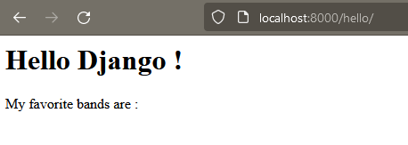
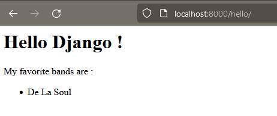
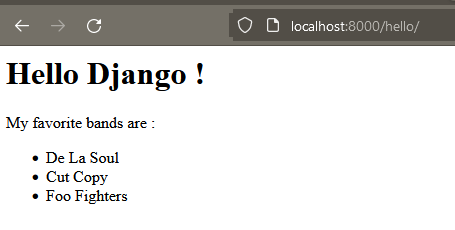
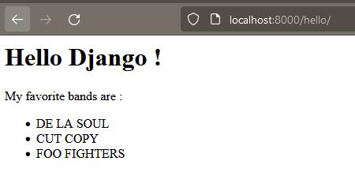
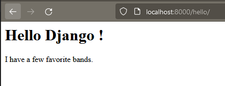

# Separate the application logic from the presentation with a Django template

# Understand templates

We will start this chapter by demonstrating an anti-pattern.

In programming, a design pattern is a style or technique that represents best practice and leads to good results. Conversely, an anti-pattern represents a bad practice, something we should avoid.

For the sake of demonstration, let's fill one of our pages with a little more HTML code.

Open `listings/views.py` and find our `hello` view. We want to start adding the structural elements of a web page, such as `<head>`, `<body>`, `<title>` and the `<html>` tag.

We could do this by adding more HTML to our view, like this:
```python
def hello(request):
    bands = Band.objects.all()
    return HttpResponse(f”””
        <html>
            <head><title>Merchex</title><head>
            <body>
                <h1>Hello Django !</h1>
                <p>My favorite bands are :<p>
                <ul>
                    <li>{bands[0].name}</li>
                    <li>{bands[1].name}</li>
                    <li>{bands[2].name}</li>
                </ul>
            </body>
        </html>
    ”””)
```

This code works... but it is an anti-pattern.

*What's wrong with this approach?*

Our view is already starting to look a bit busy and the amount of HTML here will only increase as we build our application.
The problem is that our view now has two responsibilities:
- selecting all the `Band` objects in the database: the **logic**;
- displaying the names of these bands among other contents like titles and paragraphs: the **presentation**.

If one part of our application has too many responsibilities, it becomes unmanageable.

*How to transform this anti-pattern into a design pattern, and use the best practices?*

We will adhere to the principle of single responsibility by moving the responsibility for the presentation out of sight and into its rightful place: a template.

# Add an HTML template file to the templates directory

Start by creating a new file at `listings/templates/listings/hello.html`

Note the directory structure we use here. We always put a subdirectory in the templates directory that has the same name as the application ("listings"). 

Let's fill the fill with our HTML :
```html
<html>

<head>
  <title>Merchex</title>
</head>

<body>
  <h1>Hello Django !</h1>
  <p>My favorite bands are :</p>
  <!-- TODO : list of bands -->
</body>

</html>
```

# Update the view to generate this template

Now let's update our view, so that instead of defining its own HTML, it generates our template:
```python
...
from django.shortcuts import render
...

def hello(request):
    bands = Band.objects.all()
    return render(request, 'listings/hello.html')
```
First, we import the `render` function. This element is probably already present since it is included in the base code, but add it if necessary.

In the return statement, we no longer call the `HttpResponse` constructor. Instead, we call the `render` function with 2 arguments:
- the `request` object that is passed in the `hello` function;
- a string containing the path to the template file we created.

Let's take a look at our page in the browser: [http://localhost:8000/hello/](http://localhost:8000/hello/)


This is a good start, but our group names no longer appear on the page.

We need a way to inject our model data into our template.

# Pass a contextual object to the template containing a list of objects

Let's go back to our view and add a third argument to our `render` method call. This argument must be a Python `dict`.
```python
...
return render(request,
        'listings/hello.html',
        {'first_band': bands[0]})
```
This dictionary is called a **contextual dictionary**. Each key in the dictionary becomes a variable that we can use in our model, like this:
```html
...
<p>My favorite bands are :</p>
    <ul>
        <li>{{ first_band.name }}</li>
    </ul>
...
```

Let's take a look at the page in our browser to see this in action: [http://localhost:8000/hello/](http://localhost:8000/hello/)


In valid HTML code, Django templates can include this syntax with braces, also known as the Django template language. Whenever you see double braces containing a variable name, the value of that variable will be inserted. These are called template variables.

We could continue to add each group individually to the context dictionary, but let's save time and pass them all in at once:
```python
    ...
    return render(request,
    'listings/hello.html',
    {'bands': bands})
```

Then, in the template:
```html
<p>My favorite bands are :</p>
  <ul>
    <li>{{ bands.0.name }}</li>
    <li>{{ bands.1.name }}</li>
    <li>{{ bands.2.name }}</li>
  </ul>
```
In the template code, to access an element of a list, we use `bands.0`, instead of `bands[0]` as we do in the Python code.

[http://localhost:8000/hello/](http://localhost:8000/hello/)



# Iterate over a list in a template

In programming, when we need to process a list of unknown length, we use a `for` loop, which iterates over each element and stops when there are no elements left. Django's template language has its own syntax `for` loops.

In our template, we will replace our fixed length list with a loop:
```html
<p>My favorite bands are :</p>
<ul>
  
  <li>{{ band.name }}</li>
  
</ul>
```

Here are some things to keep in mind:
- Loops and other logical statements are surrounded by square brackets and percent signs (``). These are **template tags**.
- A `for` statement is constructed using a syntax similar to Python, but without the trailing colon (`: `).
- We tend to use the conventional Python format for singular in plural in for statements.
- A `for` template tag must have a closing endfor tag later in the template.
- The space between the `for` and `endfor` tags can contain text, HTML, and even Django template variables.

Notice that the opening and closing tags `<ul>` are outside the loop: we want them to appear only once. The `<li>` tags are inside the loop, because we need them to be repeated: once for each group in the list.

Here we are again with our list, but now we generate it with a loop :
[http://localhost:8000/hello/](http://localhost:8000/hello/)


# Use a template filter (for example: truncate) in a template

Sometimes, when we inject a variable into our template, we would like to apply some formatting. **Template filters** can help us with this. Let's say we want to display our band names in a different box. We could use the `lower` or `upper` filter, like this:
``` html
# example

<li>{{ band.name|upper }}</li>
```



You apply a filter to a variable by using the vertical bar (` | `).

Filters are not limited to text formatting. Let's see how we could display the number of groups in our list, by applying the `length` filter to our list of groups:
```html
<p>
    I have 
    
        a few
    
        some
    
        a lot of of
    
        favorite bands.
</p>
```



# Time to Practice : Create Django templates for your pages!

With what you've learned, create templates for the `listings` view, the `about` view, and the `contact` view that you created in the last chapter. Your templates should be complete HTML pages, including the `<html>`, `<head>`, `<title>`, and `<body>` tags. For the listings view, you must inject your Listing objects into the template.

If you need directions, remember that you need to do the following for each template you create:
- Create a template file in `listings/templates/listings/` and give it the extension `.html`.
- Move your HTML out of the view, and into the template.
- Change the return statement of the view to call the render method and pass it the path to your template file.
- Also pass a context dictionary to the render method.
- Use template variables to inject data into your template.
- Use template tags to use loops in your template if needed.

---
## Next Step : 
### Previous step : [Save data to a database with a model and a migration](./model_migration.md#save-data-to-a-database-with-a-model-and-a-migration)
### [Back to menu](../README.md#django-tutorial)